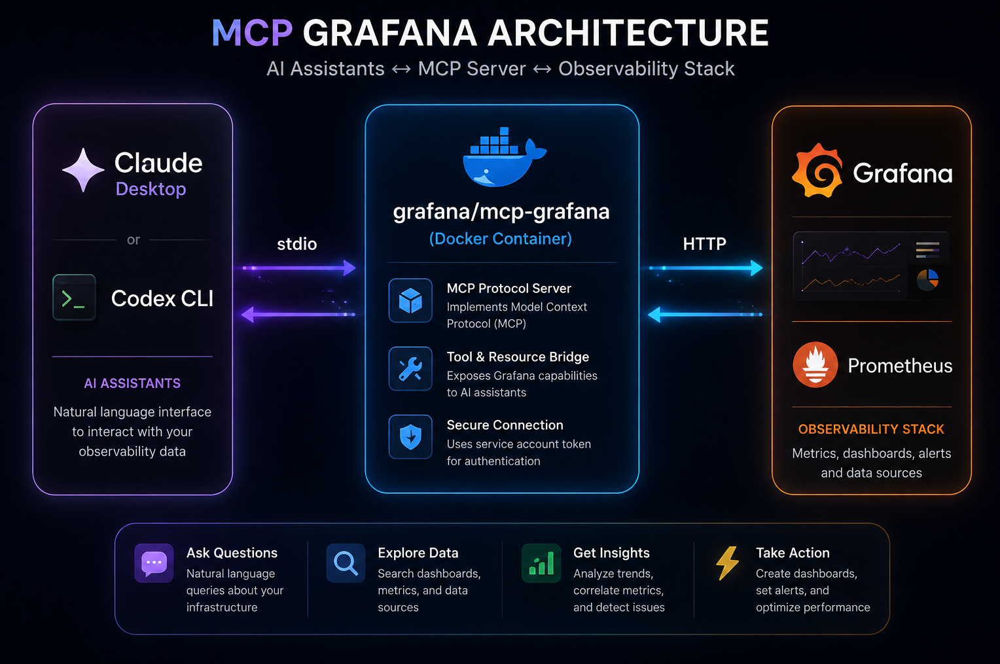

# Grafana MCP Local POC

Run Grafana + Prometheus locally and connect them to desktop MCP clients — **Claude Desktop** and **Codex / ChatGPT Desktop** — using the [`grafana/mcp-grafana`](https://hub.docker.com/r/grafana/mcp-grafana) Docker image.

This lets you query and manage a local Grafana instance directly from your AI assistant: list dashboards, inspect datasources, query Prometheus, and more, all through natural language.

> **Scope:** This setup is for local desktop use only. The MCP server runs in a local Docker container, and each desktop client's config file is updated on your machine. It will not work from a browser-only environment or as a remote/hosted server.

---

## Table of Contents

- [How it works](#how-it-works)
- [Prerequisites](#prerequisites)
- [1. Start the local stack](#1-start-the-local-stack)
- [2. Validate the services](#2-validate-the-services)
- [3. Create a Grafana service account](#3-create-a-grafana-service-account)
- [4. Pull the Grafana MCP image](#4-pull-the-grafana-mcp-image)
- [5. Configure your MCP client](#5-configure-your-mcp-client)
  - [Codex / ChatGPT Desktop](#codex--chatgpt-desktop)
  - [Claude Desktop](#claude-desktop)
- [Validating your config](#validating-your-config)
- [Useful Docker commands](#useful-docker-commands)
- [Troubleshooting](#troubleshooting)
- [References](#references)

---

## How it works

```
┌─────────────────┐        stdio         ┌──────────────────────┐        HTTP        ┌───────────┐
│  Claude Desktop  │ ───────────────────▶ │  grafana/mcp-grafana │ ──────────────────▶│  Grafana  │
│   or Codex CLI   │ ◀─────────────────── │  (Docker container)  │ ◀───────────────── │ Prometheus│
└─────────────────┘                       └──────────────────────┘                     └───────────┘
```

Your desktop client launches the MCP server as a short-lived Docker container on demand, communicating over stdio. The MCP server authenticates to your local Grafana instance using a service account token and exposes Grafana's API as a set of callable tools.



---

## Prerequisites

Make sure you have the following installed before you start:

| Requirement | Needed for |
|---|---|
| [Docker](https://docs.docker.com/get-docker/) | Running Grafana, Prometheus, and the MCP server |
| [Docker Compose](https://docs.docker.com/compose/install/) | Starting the local stack |
| [Claude Desktop](https://claude.ai/download) | If configuring Claude |
| [Codex / ChatGPT Desktop](https://openai.com/chatgpt/desktop/) | If configuring Codex |

---

## 1. Start the local stack

Clone this repo, then start the containers:

```bash
docker-compose up -d
```

This brings up local Grafana and Prometheus instances in the background.

## 2. Validate the services

Once the containers are running, confirm both services are reachable in your browser:

| Service | URL |
|---|---|
| Prometheus | [http://localhost:9090/query](http://localhost:9090/query) |
| Grafana | [http://localhost:3000](http://localhost:3000) |

## 3. Create a Grafana service account

The MCP server authenticates to Grafana using a **service account token**, not a personal login.

1. Log in to Grafana at [http://localhost:3000](http://localhost:3000).
2. Go to **Administration → Users and access → Service accounts**.
3. Create a new service account and generate an access token for it.
4. Copy the token value — you'll need it in the next steps as:

   ```text
   TOKEN_VALUE_CREATED_IN_GRAFANA_UI
   ```

   You won't be able to view this token again after leaving the page, so store it somewhere safe (e.g. a password manager) rather than only pasting it into a config file.

## 4. Pull the Grafana MCP image

```bash
docker pull grafana/mcp-grafana
```

This ensures the image is available locally so your desktop client can start the MCP server container on demand.

Once your desktop client has launched the server, you can confirm it's running with:

```bash
docker ps
```

You should see a `grafana/mcp-grafana` container in the list.

---

## 5. Configure your MCP client

The MCP server is configured **locally** in each desktop client's own config file. There is no remote server involved — each client starts its own container.

**Before you begin:** quit any open instances of Claude Desktop and/or Codex / ChatGPT Desktop. Config changes are only picked up on startup.

### Codex / ChatGPT Desktop

Edit the Codex config file:

```bash
vi ~/.codex/config.toml
```

Add the following block:

```toml
[mcp_servers.grafana]
command = "docker"
args = ["run", "--rm", "-i", "-e", "GRAFANA_URL", "-e", "GRAFANA_SERVICE_ACCOUNT_TOKEN", "grafana/mcp-grafana", "-t", "stdio"]

[mcp_servers.grafana.env]
GRAFANA_URL = "http://host.docker.internal:3000"
GRAFANA_SERVICE_ACCOUNT_TOKEN = "TOKEN_VALUE_CREATED_IN_GRAFANA_UI"
```

Replace `TOKEN_VALUE_CREATED_IN_GRAFANA_UI` with the access token you created in [Step 3](#3-create-a-grafana-service-account).

### Claude Desktop

Edit the Claude Desktop config file:

```bash
vi ~/Library/Application\ Support/Claude/claude_desktop_config.json
```

Add or update the `mcpServers` section:

```json
{
  "mcpServers": {
    "grafana": {
      "command": "/usr/local/bin/docker",
      "args": [
        "run",
        "--rm",
        "-i",
        "-e",
        "GRAFANA_URL",
        "-e",
        "GRAFANA_SERVICE_ACCOUNT_TOKEN",
        "grafana/mcp-grafana",
        "-t",
        "stdio"
      ],
      "env": {
        "GRAFANA_URL": "http://host.docker.internal:3000",
        "GRAFANA_SERVICE_ACCOUNT_TOKEN": "TOKEN_VALUE_CREATED_IN_GRAFANA_UI"
      }
    }
  }
}
```

Replace `TOKEN_VALUE_CREATED_IN_GRAFANA_UI` with the access token you created in [Step 3](#3-create-a-grafana-service-account).

> Confirm the `command` path matches your local Docker install (`which docker`) — it isn't always `/usr/local/bin/docker`, especially on Apple Silicon or Docker Desktop alternatives like Colima.

After saving, reopen the desktop app so it picks up the new MCP server config.

---

## Validating your config

Claude Desktop's config file must be valid JSON, or the app will silently fail to load it. Check it with:

```bash
python3 -m json.tool ~/Library/Application\ Support/Claude/claude_desktop_config.json
```

If this prints nicely formatted JSON with no errors, your config file is valid.

---

## Useful Docker commands

| Command | What it does |
|---|---|
| `docker-compose pull` | Pull the latest images for Grafana and Prometheus |
| `docker-compose up -d` | Start the stack in detached mode |
| `docker-compose logs` | View logs from all running containers |
| `docker-compose down -v` | Stop and remove containers, networks, **and volumes** — use this for a full clean reset |

---

## Troubleshooting

| Symptom | Likely cause / fix |
|---|---|
| Desktop client doesn't show a Grafana tool | App wasn't fully restarted after the config change, or the config file has invalid JSON/TOML — re-check with the [validation step](#validating-your-config) |
| MCP server container fails to start | Confirm `docker pull grafana/mcp-grafana` succeeded and that the `command` path to `docker` in your config is correct |
| Connection refused to Grafana | Make sure `docker-compose up -d` is running and Grafana is reachable at [http://localhost:3000](http://localhost:3000); on Linux, `host.docker.internal` may need `--add-host=host.docker.internal:host-gateway` added to the `args` |
| 401/403 errors from Grafana tools | Token may be expired, revoked, or copied incorrectly — regenerate it in **Administration → Service accounts** |

---

## References

- [Grafana MCP server (Docker Hub)](https://hub.docker.com/r/grafana/mcp-grafana)
- [ChatGPT / Codex Desktop MCP documentation](https://learn.chatgpt.com/docs/extend/mcp?surface=app)
- [Claude Desktop MCP Documentation](https://modelcontextprotocol.io/docs/2026-07-28/develop/connect-local-servers)


## Important Notes
```
As connections from Claude Desktop and codex are established via mcp servers and these mcp servers are running as docker containers. If you kill these the connection is lost. While codex was able to recreate the connection by creating mcp server container locally, with Claude I had to quit and open the desktop app so it creates the local mcp server by default. 
```
